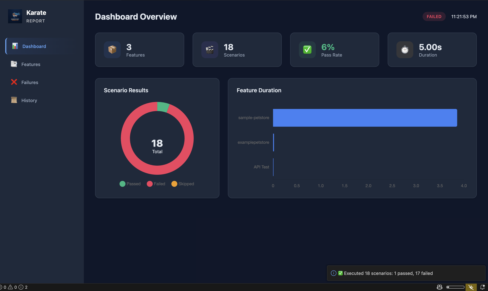
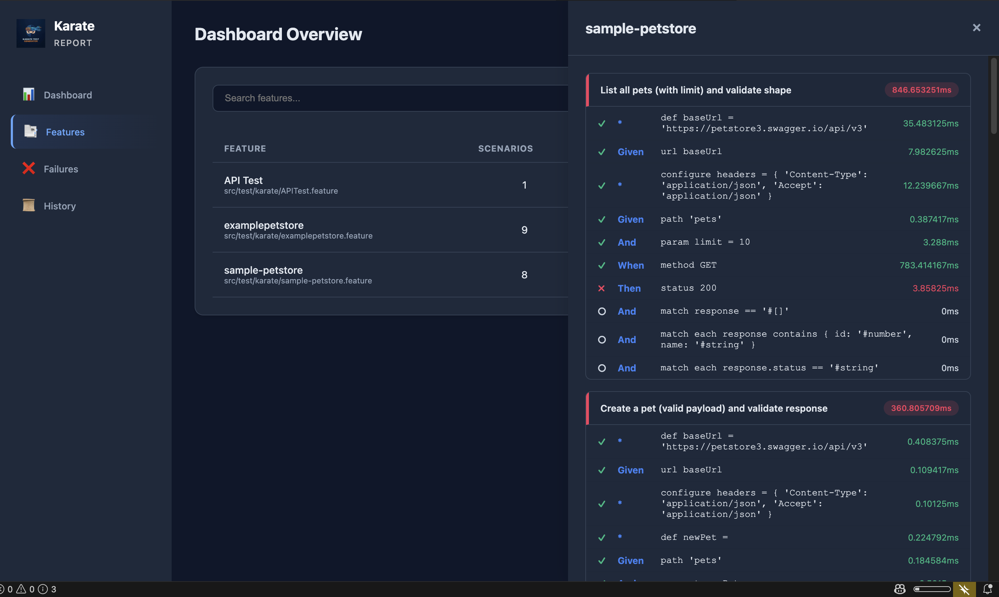
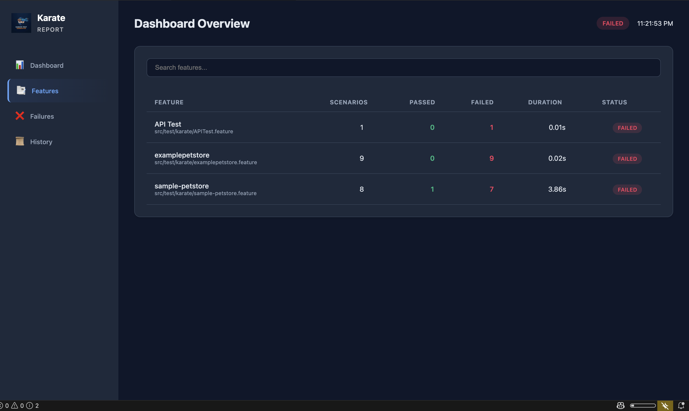

# Karate API Test Generator for VS Code

> **The complete Karate DSL toolkit** — Generate, execute, maintain, and analyze API tests with AI assistance.

Transform OpenAPI specs, Postman collections, and Confluence docs into production-ready Karate tests in seconds. Run them from your editor, track coverage, and let AI keep everything in sync as your API evolves.

[](https://marketplace.visualstudio.com/items?itemName=MuthuKumarKoodalingam.karate-test-generator)
[](https://code.visualstudio.com/)
[](LICENSE)

**Keywords**: Karate API testing, OpenAPI test generation, API automation, Karate DSL, REST API testing, BDD API tests, QA automation, contract testing, Postman to Karate converter

---

## 🆕 What's New in v1.5.1

### 🐞 Karate API Bug Hunter
- **Find Real API Bugs from OpenAPI**: Run bounded live probes against local or staging APIs and detect schema drift, 5xx crashes, validation bypasses, missing-auth acceptance, BOLA smoke findings, and injection-smoke issues.
- **Export Regressions**: Every finding includes a curl reproducer and can be saved as a runnable Karate regression scenario.
- **Probe Trace Report**: Reports show every executed probe, every skipped probe with reason, HTTP status, and linked findings.
- **Sidebar Launch**: The extension UI includes a Bug Hunt tab for starting `Karate: Hunt API Bugs`.
- **Spec-Derived Target**: Bug Hunter reads the target from OpenAPI `servers.url` and prompts only when it is missing or invalid.
- **Safe Defaults**: Safe mode skips destructive methods unless explicitly enabled, caps request count/concurrency/timeouts, and redacts secrets in reports.
- **Release Hardening**: Clean builds, package-content audits, and CI verification keep VSIX contents aligned with runtime needs.

## Previously in v1.5.0

### 🛠️ Reliability, Docs, and Adoption
- **In-Extension Help Refresh**: The Help & Guide tab now covers quick start, AI setup, coverage, flakiness tiers, shared style files, CI repair, and MCP setup.
- **Execution Visibility**: Run summaries and the execution dashboard now surface flakiness tier counts (`stable`, `watch`, `flaky`, `broken`) for faster stability triage.
- **Shared Style Everywhere**: `karateDsl.generation.sharedStylePath` is now honored across webview flows, explorer/direct commands, combined generation, and coverage-generated missing tests.
- **Safer CI Pull Repair**: GitHub Actions pull-mode now retries runs when artifacts/logs fail to produce a repair payload instead of prematurely deduping them away.
- **Stronger MCP Repair Flow**: `repair_test` now updates both `Scenario` and `Scenario Outline` blocks and returns a proper failure when the target scenario is not matched.
- **README + Marketplace Alignment**: Commands, settings, and screenshot assets are aligned with the current extension build and package cleanly for VS Code extension pages.

## 🚀 Previously in v1.4.0

### 🤖 Multi-AI Backend (Ollama, Claude API, Copilot)
- **Pluggable Architecture**: Support for local inference (Ollama), Claude API, and GitHub Copilot.
- **Secure Configuration**: Uses VS Code SecretStorage for Claude API keys. 

### 🛠️ AI-native CI Test Repair
- **Dual Ingestion Modes**: Pull failed GitHub Actions runs (default), webhook listener, or both.
- **GitHub Pull Mode**: Polls failed runs, dedupes run attempts, extracts artifacts/logs, and routes to repair flow.
- **Test Repair**: AI-powered repair suggestions with diff view, auto-apply, and backup-before-repair modes.

### 🔎 Flaky Test Detector
- **FlakinessAnalyzer**: Detects unstable scenarios and provides AI-powered stabilization suggestions.
- **Tier Labels**: `stable | watch | flaky | broken` with configurable thresholds.
- **Trend Detection**: Tracks scenario stability across runs (improving/stable/degrading).

### 🎨 Shared Team Style
- **Shared Style File**: Use `karateDsl.generation.sharedStylePath` to enforce a team-wide `.karate-style.json`.
- **Precedence**: Shared style overrides learned local style, then generator defaults.

### 🔌 Extension-Managed MCP Server
- **5 Tool Suite**: `generate_tests`, `check_coverage`, `repair_test`, `list_flaky`, `run_feature`.
- **Transport**: HTTP JSON-RPC with SSE compatibility endpoint support.
- **Security**: Bearer token auth via VS Code SecretStorage.

### 🗃️ Smart Test Data Engine
- **Field-Aware Generation**: Meaningful data based on field names (email, phone, UUID, dates) and OpenAPI boundaries.
- **Scenario Outline Builder**: Generates data-driven outlines mapping positive, negative (400), and boundary cases.

### 🌐 GraphQL Support
- **SDL & Introspection API**: Generate tests from `.graphql` files or live server introspection.
- **Operation Coverage**: Automatically covers operations with positive and negative testing.

### 📂 Batch Generation & Jira Integration
- **Batch Processing**: Recursive generation from a folder containing multiple OpenAPI files.
- **Jira Automation**: Automatically construct Karate acceptance criteria from Jira issues.
- **Semantic Path Matching**: Upgraded 3-tier semantic matching system with AI judgement avoiding false coverage positives.

---

## 🚀 Earlier Highlights from v1.3.5

### 🔍 Universal Config Discovery
- **Workspace-Wide Search**: Automatically finds `karate-config.js` and runner classes anywhere in your project — no more hardcoded paths.
- **LLM-Powered Suggestions**: Copilot suggests optimal classpath and JVM args based on your project structure.

### ⚙️ Custom Execution Parameters
Three new settings let you control exactly how tests run:

| Setting | Example | Purpose |
|:--------|:--------|:--------|
| `systemProperties` | `{"karate.env": "staging"}` | `-D` flags for every run |
| `jvmArgs` | `["-Xmx1g"]` | JVM tuning flags |
| `karateArgs` | `["--threads", "5"]` | Karate CLI arguments |

### 📥 HAR File Import
- **One-Click Import**: Convert `.har` files from browser DevTools into Karate feature files.
- **AI Enhancement**: Copilot enriches imported requests with assertions and error scenarios.

---

## ⚡ Why Karate API Test Generator?

Stop wasting hours manually writing Boilerplate Gherkin. Let AI handle the structure so you can focus on business logic.

| Workflow | Manual | With This Extension |
|:---------|:------:|:-------------------:|
| **New Test Creation** | 15–30 min | **< 30 seconds** |
| **OpenAPI Sync** | Manual tracking | **Auto-detect & Update** |
| **Postman Migration** | Rewrite everything | **One-click Import** |
| **Test Quality** | Peer review needed | **Copilot Optimized** |
| **Coverage Visibility** | Spreadsheet hell | **Visual Dashboard** |

---

## ✨ Features at a Glance

### 🤖 AI-Powered Test Generation
Generate tests from **three input sources**, each enhanced by GitHub Copilot:

- **OpenAPI / Swagger** — Right-click any `.json`, `.yaml`, or `.yml` spec → *Generate Tests Now*
- **Confluence Documentation** — Pull API docs from Confluence pages and generate tests
- **Combined (OpenAPI + Confluence)** — Merge spec structure with documentation context for the richest tests

Copilot adds: smart assertions, realistic test data, edge-case scenarios (400, 401, 404, 500), and performance tests.

### 🧪 Native Test Executor
Run Karate tests directly from VS Code — no terminal required.

- **CodeLens Actions**: Click **▶ Run Feature** or **▶ Run Scenario** inline in `.feature` files
- **Testing Sidebar**: All features and scenarios appear in the VS Code Testing tab
- **Auto-Discovery**: Every `.feature` file in your workspace is detected automatically
- **Build Tool Support**: CLI (standalone JAR), Maven, or Gradle — auto-detected or configurable

### 📊 Premium Execution Dashboard
A modern, interactive dashboard replaces plain-text reports.



- **Visual Analytics**: Donut charts for pass/fail rates, bar charts for duration
- **Feature Drill-Down**: Expand any feature to inspect scenarios and step-level details
- **Flakiness Tier Summary**: Execution summaries include `stable`, `watch`, `flaky`, and `broken` counts
- **Search & Filter**: Find failing tests instantly
- **Dark Mode**: Full VS Code theme support with glassmorphism effects





### 📈 Visual Test Coverage
Track which API endpoints have tests and which don't.

- **Coverage Dashboard**: See tested vs untested endpoints at a glance
- **Gap Analysis**: Identify missing test scenarios per endpoint
- **Generate Missing Tests**: Click to generate tests for uncovered endpoints
- **Shared Style Aware**: Missing-test generation respects workspace shared style files before learned local style
- **Append to Existing Files**: Add AI-generated scenarios to existing feature files with matching style

### 🐞 API Bug Hunter
Find real API bugs from an OpenAPI spec and export each finding as a Karate regression.

- **Live Probes**: Generate valid and mutated payloads from OpenAPI schemas
- **Finding Types**: Schema drift, server crashes, validation bypasses, missing auth, BOLA smoke, and injection smoke
- **Probe Trace**: See every executed probe, skipped probe reason, response status, and linked finding
- **Repro Artifacts**: Dashboard details, curl command, and runnable `.feature` export
- **UI Launch**: Start from the Bug Hunt tab or Command Palette
- **Base URL**: Uses the first absolute OpenAPI `servers.url`, with prompt fallback
- **Safe Mode**: Destructive method probes stay off unless explicitly enabled

### 📦 Postman Collection Import
Migrate from Postman to Karate in one click.

- **Full Collection Conversion**: Collections + environments → Karate feature files
- **Variable Translation**: Postman `{{variables}}` become Karate `karate.properties`
- **Script Conversion**: Pre-request scripts and test assertions converted via Copilot

### 📥 HAR File Import
Convert real API traffic into Karate tests.

- **Browser DevTools**: Export a `.har` file from Chrome/Firefox DevTools → import into the extension
- **AI Enhancement**: Copilot analyzes requests and generates assertions, schema checks, and error scenarios
- **Selective Import**: Choose which requests to convert — filter by domain, method, or status code

### 🔄 Automatic Test Maintenance
When your OpenAPI spec changes, the extension keeps tests in sync.

1. **Detects changes** when you save the spec
2. **Analyzes impact** on existing test files
3. **Uses Copilot** to intelligently update affected tests
4. **Preserves custom logic** you've added manually

### 🩺 Project Health Doctor
Real-time code quality analysis for Karate projects.

- **Linter**: Catches errors as you type — hardcoded URLs, duplicate scenarios, indentation issues
- **Security Scanner**: Detects missing auth tests and hardcoded secrets
- **Quick Fixes**: One-click auto-fixes for common issues
- **Health Dashboard**: Visualize project structure and dependencies

### 🎨 Style Learning
Maintain consistency across your team's tests.

- **Learn from Examples**: Right-click a well-formatted `.feature` file → *Learn Style Now*
- **Team Baseline**: Set `karateDsl.generation.sharedStylePath` to apply a shared `.karate-style.json` across the workspace
- **Future Consistency**: All generated tests match your team's patterns
- **Template System**: Save and reuse preferred test structures

### 🛡️ Copilot Transparency & Privacy
Full visibility into AI interactions.

- **Activity Log**: View every prompt and response (`Cmd+Shift+P` → *Show Copilot Activity Log*)
- **Privacy**: Sensitive data (API keys, tokens) is automatically redacted
- **Performance Metrics**: See response times and token usage

---

## 🚀 Quick Start

### 1. Install
Search for **"Karate Test Generator"** in the VS Code Extensions marketplace, or install from the [Marketplace page](https://marketplace.visualstudio.com/items?itemName=MuthuKumarKoodalingam.karate-test-generator).

### 2. Generate Your First Test

**Option A — Right-Click Menu** (fastest):
1. Right-click any OpenAPI spec file (`.json`, `.yaml`, `.yml`)
2. Select **Karate: Generate Tests Now**
3. Click **Open File** to view the generated `.feature` file

**Option B — Extension Panel**:
1. Click the **Karate icon** in the Activity Bar
2. Navigate to the **OpenAPI** tab
3. Select your spec file and click **Generate Tests**

### 3. Run Tests
- Click **▶ Run Feature** above the `Feature:` line in any `.feature` file
- Or open the **Testing** sidebar and click the play button

### 4. Enable AI Enhancement (optional)
1. Install the **GitHub Copilot** extension
2. Generate tests as usual — Copilot automatically enhances them with richer assertions and edge cases

---

## 📖 Usage Guide

### Generating from OpenAPI

```
Right-click spec.yaml → "Karate: Generate Tests Now"
```

Or use the Extension Panel → **OpenAPI** tab with the Copilot toggle for AI-enhanced output.

### Generating from Confluence

1. Open the Extension Panel → **Confluence** tab
2. Enter the Confluence page URL
3. Provide credentials (see [Configuration](#-configuration) below)
4. Click **Generate Tests**

**Extracted content**: API endpoint descriptions, request/response examples, business logic, edge cases.

### Combined Generation (OpenAPI + Confluence)

1. Open the Extension Panel → **Combined** tab
2. Select the OpenAPI spec file
3. Enter the Confluence documentation URL
4. Click **Generate Tests**

**Result**: Tests combine the **structure** from your OpenAPI spec with the **business context** from your documentation.

### Generating from GraphQL, Jira, or a Directory

- **GraphQL**: Right-click a `.graphql` / `.gql` file or run `Karate: Generate Tests from GraphQL`
- **Jira**: Use `Karate: Generate Tests from Jira` to turn issue content and acceptance criteria into Karate scenarios
- **Directory Batch Mode**: Right-click a folder or run `Karate: Generate Tests from Directory` to process multiple specs in one pass

### Importing Postman Collections

```
Cmd+Shift+P → "Karate: Import Postman Collection"
```

Select your Postman collection file (`.json`) and optionally an environment file.

### Running Tests

| Method | Where | Scope |
|:-------|:------|:------|
| **▶ Run Feature** (CodeLens) | Above `Feature:` line | Entire feature |
| **▶ Run Scenario** (CodeLens) | Above each `Scenario:` | Single scenario |
| **Testing Sidebar** | VS Code Testing tab | Any combination |
| **Karate: Run All Tests in Folder** | Command palette | All features in folder |
| **Karate: Run Tests by Tags** | Command palette | Tag-filtered execution |
| **Karate: Show Test Execution Report** | Command palette | Latest rich execution dashboard |
| **Karate: Show Test History** | Command palette | Historical run inspection |

### Learning Style

```
Right-click your best .feature file → "Karate: Learn Style Now"
```

All future generations will match this file's formatting, naming, and assertion patterns.

### CI Repair + MCP Quick Setup

1. **Enable CI repair**: Set `karateDsl.ciRepair.enabled` to `true`
2. **Choose ingestion mode**: Leave `karateDsl.ciRepair.mode` as `pull` (default), or switch to `webhook` / `both`
3. **Store GitHub credentials**: Run `Karate: Set GitHub Token`
4. **Review bridge snippets**: Run `Karate: Show CI Bridge Guide` for GitHub Actions or webhook integration help
5. **Enable MCP host**: Set `karateDsl.mcp.enabled` to `true`
6. **Copy client config**: Run `Karate: Show MCP Connection Info` to get the connection JSON and rotate the Bearer token

Available MCP tools: `generate_tests`, `check_coverage`, `repair_test`, `list_flaky`, `run_feature`.

---

## ⚙️ Configuration

Access settings via **Preferences → Settings** and search for `karateDsl`.

### Execution Settings

| Setting | Default | Description |
|:--------|:--------|:------------|
| `karateDsl.execution.defaultBuildTool` | `cli` | Build tool: `cli`, `maven`, or `gradle` |
| `karateDsl.execution.parallelThreads` | `1` | Number of parallel threads |
| `karateDsl.execution.configPath` | `""` | Custom path to `karate-config.js` or runner class |
| `karateDsl.execution.additionalClasspath` | `[]` | Extra classpath entries |
| `karateDsl.execution.systemProperties` | `{}` | System properties as `-D` flags (e.g., `{"karate.env": "local"}`) |
| `karateDsl.execution.jvmArgs` | `[]` | JVM arguments (e.g., `["-Xmx512m"]`) |
| `karateDsl.execution.karateArgs` | `[]` | Karate CLI arguments (e.g., `["--threads", "5"]`) |
| `karateDsl.execution.autoOpenReport` | `true` | Auto-open execution report after runs |
| `karateDsl.execution.historyLimit` | `50` | Max execution history entries |

### Confluence Settings

| Setting | Description |
|:--------|:------------|
| `karateDsl.confluence.baseUrl` | Confluence URL (e.g., `https://confluence.company.com`) |
| `karateDsl.confluence.email` | Your email (Cloud) or leave empty (Data Center) |
| `karateDsl.confluence.apiToken` | Atlassian API Token (Cloud) or PAT (Data Center) |
| `karateDsl.confluence.authType` | `basic` for Cloud, `bearer` for Data Center |

### Copilot Settings

| Setting | Default | Description |
|:--------|:--------|:------------|
| `karate.copilot.logging.enabled` | `true` | Toggle AI activity logging |
| `karate.copilot.logging.redactSensitiveData` | `true` | Auto-redact secrets from logs |
| `karate.copilot.logging.showTokenUsage` | `true` | Show token consumption stats |

### CI Repair Settings

| Setting | Default | Description |
|:--------|:--------|:------------|
| `karateDsl.ciRepair.enabled` | `false` | Enable CI failure ingestion + repair flow |
| `karateDsl.ciRepair.mode` | `pull` | `pull`, `webhook`, or `both` |
| `karateDsl.ciRepair.github.owner` | `""` | GitHub repository owner |
| `karateDsl.ciRepair.github.repo` | `""` | GitHub repository name |
| `karateDsl.ciRepair.github.workflow` | `""` | Optional workflow ID/file filter |
| `karateDsl.ciRepair.github.branch` | `main` | Branch filter for pull mode |
| `karateDsl.ciRepair.github.pollIntervalSec` | `90` | Poll interval for pull mode |
| `karateDsl.ciRepair.github.artifactNamePattern` | `karate\|junit\|test\|report` | Artifact name regex filter |
| `karateDsl.ciRepair.github.lookbackMinutes` | `120` | Lookback window for failed runs |
| `karateDsl.ciRepair.webhookPort` | `47392` | Local webhook port (webhook/both modes) |

Use command palette: **Karate: Set GitHub Token** to store PAT securely.

### Flakiness Settings

| Setting | Default | Description |
|:--------|:--------|:------------|
| `karateDsl.flakiness.enabled` | `true` | Enable flakiness analysis |
| `karateDsl.flakiness.windowSize` | `20` | Historical runs considered |
| `karateDsl.flakiness.threshold` | `0.15` | Legacy flagged threshold |
| `karateDsl.flakiness.thresholds.watch` | `0.2` | `watch` tier lower bound |
| `karateDsl.flakiness.thresholds.flaky` | `0.5` | `flaky` tier lower bound |
| `karateDsl.flakiness.thresholds.broken` | `0.8` | `broken` tier lower bound |

### Generation Style Settings

| Setting | Default | Description |
|:--------|:--------|:------------|
| `karateDsl.generation.sharedStylePath` | `""` | Shared `.karate-style.json` path (relative or absolute) |

### MCP Settings

| Setting | Default | Description |
|:--------|:--------|:------------|
| `karateDsl.mcp.enabled` | `false` | Enable extension-managed MCP server |
| `karateDsl.mcp.host` | `127.0.0.1` | MCP bind host |
| `karateDsl.mcp.port` | `47393` | MCP bind port |
| `karateDsl.mcp.tokenAuthEnabled` | `true` | Require Bearer token authentication |

Use command palette: **Karate: Show MCP Connection Info** to view/copy connection JSON and rotate token.

### Bug Hunter Settings

| Setting | Default | Description |
|:--------|:--------|:------------|
| `karateDsl.bugHunter.safeMode` | `true` | Skip destructive probes unless explicitly enabled |
| `karateDsl.bugHunter.maxRequests` | `100` | Maximum live probes per run |
| `karateDsl.bugHunter.timeoutMs` | `5000` | Per-probe HTTP timeout |
| `karateDsl.bugHunter.concurrency` | `2` | Concurrent probes |
| `karateDsl.bugHunter.includeDestructiveMethods` | `false` | Allow POST, PUT, PATCH, DELETE probes |

### Agent Skills (VS Code 1.108+)

| Setting | Default | Description |
|:--------|:--------|:------------|
| `karateDsl.agentSkills.enabled` | `true` | Enable Karate-specific skills for Copilot |
| `karateDsl.agentSkills.autoSuggest` | `true` | Auto-suggest relevant skills |

Agent Skills provide Karate-specific domain knowledge (syntax patterns, API testing best practices, conversion rules) to GitHub Copilot. Automatically enabled on VS Code 1.108+; gracefully disabled on earlier versions.

---

## 📝 Example Output

**Input**: OpenAPI spec with `/pets/{id}` endpoint

**Generated Test**:
```gherkin
Feature: Pet API Tests

  Background:
    * url baseUrl
    * def petId = 1

  Scenario: Get pet by ID - Success
    Given path 'pets', petId
    When method GET
    Then status 200
    And match response.id == petId
    And match response.name == '#string'

  Scenario: Get pet by ID - Not Found
    Given path 'pets', 99999
    When method GET
    Then status 404
```

---

## 🔧 Requirements

| Requirement | Version | Notes |
|:------------|:--------|:------|
| **VS Code** | 1.108.0+ | Required |
| **Java** | 8+ | Required for running Karate tests |
| **GitHub Copilot** | Latest | Optional, for AI-enhanced features |

---

## 🐛 Troubleshooting

**Tests not generating?**
- Verify the file is a valid OpenAPI spec (JSON/YAML)
- Check the Output panel → **Karate Test Generator** for errors

**Copilot not working?**
- Ensure GitHub Copilot extension is installed and activated (check status bar)
- Verify you have an active Copilot subscription

**karate.env not being applied?**
- Set it in `systemProperties`, not as a separate environment setting:
  ```json
  "karateDsl.execution.systemProperties": { "karate.env": "local" }
  ```
- Check Output panel for `[DEBUG] User systemProperties:` to confirm it's read

**Config file not found?**
- The extension searches your entire workspace. Check Output panel for discovery logs.
- Use `karateDsl.execution.configPath` to set an explicit path.

---

## 📚 Documentation

- [Copilot Integration Guide](docs/COPILOT_GUIDE.md)
- [Development Setup](DEVELOPMENT.md)

## 📄 License

MIT License — see [LICENSE](LICENSE) for details.

## 🙏 Acknowledgments

- Built with [Karate DSL](https://github.com/karatelabs/karate)
- Powered by [GitHub Copilot](https://github.com/features/copilot)
- OpenAPI parsing by [@apidevtools/swagger-parser](https://github.com/APIDevTools/swagger-parser)

## 💬 Feedback & Support

- 🐛 [Report Issues](https://github.com/mov2day/KaratePlugin/issues)
- 💡 [Request Features](https://github.com/mov2day/KaratePlugin/issues/new)
- ⭐ [Star on GitHub](https://github.com/mov2day/KaratePlugin)

---

**Made with ❤️ for the Karate testing community**
