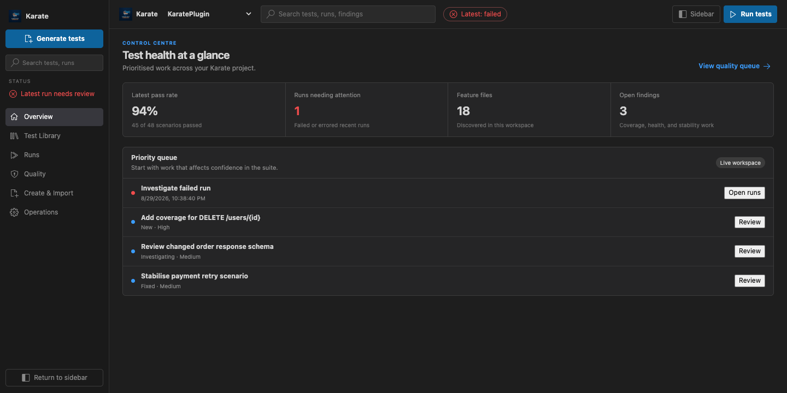

# Karate Test Management for VS Code

Generate, run, manage, and improve Karate API tests without leaving VS Code.

Karate Test Management brings test creation, execution, coverage, quality, and maintenance into one professional workspace. Use the compact Activity Bar view for quick actions, then open the expanded workspace when you need the full test library, run history, quality queue, or import tools.

## Version 2.0 highlights

- **One management workspace** — Overview, Test Library, Runs, Quality, Create & Import, and Operations share one consistent interface.
- **Compact and expanded views** — stay productive in the sidebar or move into a full editor tab for data-dense workflows.
- **Reliable project-aware execution** — automatically discovers simple projects, Maven modules, Gradle modules, and configured custom runners.
- **Exact scenario runs** — CodeLens and editor actions target the selected scenario by source line and exact name.
- **Actionable quality queue** — organize coverage gaps, specification changes, health issues, flaky tests, and failures from New through Verified.
- **Searchable test library** — browse scenarios with tags, ownership, lifecycle status, stability, and Zephyr traceability.
- **Flexible coverage analysis** — analyze an OpenAPI specification on its own, or add feature files for exact scenario-to-endpoint mapping.
- **Safer shared state** — workspace metadata uses Git-friendly UUID entity files with multi-root isolation and retained run history.
- **Local, theme-aware UI** — bundled assets, strict content security, keyboard navigation, and native VS Code light/dark theme support.
- **Unified AI routing** — every AI-assisted workflow uses one selected provider, focused Karate instructions, and the same validation guardrails.
- **Quota-conscious Copilot** — live model discovery replaces stale model lists; efficient routing is the default and highest-quality models require explicit selection.
- **One AI choice per workflow** — the Create & Import checkbox is carried through the complete run, so Postman and HAR imports no longer ask the same AI question again after file selection.

All existing command IDs and settings remain available in 2.0.

## What you can do

| Workflow | Capabilities |
|---|---|
| Create and import | OpenAPI, OpenAPI + Confluence, Confluence, Postman, HAR, GraphQL, Jira, and recorded sessions |
| Execute | Feature, exact scenario, folder, tags, saved profiles, environments, and parallel workers |
| Manage | Indexed scenario library, run history, failure drill-down, rerun, repair review, ownership, and Zephyr links |
| Improve quality | OpenAPI coverage, missing-test generation, project health, flakiness, specification change impact, and Bug Hunter |
| Automate | GitHub Actions repair intake, Zephyr Scale result publishing, MCP tools, and shared generation styles |

## Quick start

### Install

Install **Karate Test Management** from the [Visual Studio Marketplace](https://marketplace.visualstudio.com/items?itemName=MuthuKumarKoodalingam.karate-test-generator), then open a folder containing Karate `.feature` files or an API specification.

### Open the workspace

1. Select the Karate application icon in the Activity Bar.
2. Use the compact sidebar for search, status, generation, and run actions.
3. Select **Open** to launch the expanded Test Management workspace.

### Create tests

Open **Create & Import** and choose a source. The guided flow keeps source selection, scenario intent, templates, and optional AI enhancement together.

You can also right-click a supported file and choose the relevant Karate command:

- OpenAPI: `.json`, `.yaml`, `.yml`
- Postman: collection JSON
- HAR: `.har`
- GraphQL: `.graphql`, `.gql`, or introspection JSON

### Run tests

- Select **Run Feature** above a `Feature:` declaration.
- Select **Run Scenario** above a `Scenario:` or `Scenario Outline:` declaration.
- Run a folder or tag selection from the command palette or the Runs area.
- Save repeatable run profiles with an environment and worker count.

The executor inspects the target feature and surrounding project before choosing a strategy:

1. A configured runner class and method, when provided.
2. The nearest Maven or Gradle module and discovered runner.
3. The standalone Karate CLI for simple projects.

### Analyze coverage

Open **Quality** and select **Analyze coverage**.

- Choose an OpenAPI specification to measure contract coverage.
- Feature files are optional. Add them when you want exact scenario mapping and evidence.
- Review covered and uncovered endpoints, then generate missing tests from the gaps.

## Test management workspace

### Overview

See the latest pass rate, failed runs, discovered features, open findings, and a prioritized work queue.

### Test Library

Search the indexed scenario inventory and manage tags, ownership, lifecycle status, flakiness, source location, and Zephyr keys.

### Runs

Create run profiles, select environments, follow active execution, inspect history and trends, compare runs, open failed scenarios, and review AI-assisted repairs before applying them.

### Quality

Keep coverage, project health, flakiness, and specification changes in a managed workflow:

`New → Investigating → Fixed → Verified`

Invalid transitions are blocked so findings cannot skip required review stages.

### Create & Import

Generate deterministic Karate tests and optionally enhance them through a configured AI provider. Shared style files and reusable templates help teams produce consistent suites.

### Operations

Access Bug Hunter, CI repair, Zephyr publishing, credentials, settings, learned styles, generation history, and the user-invoked bug reporter.

## Execution configuration

Automatic discovery works for most projects. Use these settings only when your repository needs explicit control.

| Setting | Purpose |
|---|---|
| `karateDsl.execution.buildTool` | Select `auto`, `maven`, `gradle`, or `cli` |
| `karateDsl.execution.runnerClass` | Fully qualified Maven/Gradle runner class |
| `karateDsl.execution.runnerMethod` | Optional JUnit runner method |
| `karateDsl.execution.mavenGoal` | Maven goal used for execution |
| `karateDsl.execution.gradleTask` | Gradle task used for execution |
| `karateDsl.execution.configPath` | Custom `karate-config.js` file or containing directory |
| `karateDsl.execution.parallelism` | Parallel worker count |
| `karateDsl.execution.systemProperties` | JVM `-D` properties such as `karate.env` |
| `karateDsl.execution.jvmArgs` | Additional JVM arguments |
| `karateDsl.execution.karateArgs` | Additional Karate CLI arguments |
| `karateDsl.execution.jarPath` | Exact local standalone Karate JAR |
| `karateDsl.execution.karateVersion` | Download and cache a selected standalone Karate version |
| `karateDsl.execution.historyLimit` | Number of v2 run-history entries retained per workspace folder |

Karate 2.x standalone execution requires Java 21 or later. Leaving `jarPath` and `karateVersion` blank keeps the bundled Karate `1.5.0.RC3` JAR for compatibility.

## AI providers

AI enhancement is optional. The extension supports:

- GitHub Copilot as the default provider, with live model discovery and efficient, balanced, or explicit highest-quality routing
- Other language-model providers registered with VS Code
- Claude API credentials stored in VS Code SecretStorage
- Installed local Ollama models discovered from the running Ollama service

Run **Karate: Configure AI Routing** to choose one provider for generation, imports, coverage guidance, repair, flakiness analysis, and suggestions. Copilot's default **Efficient** mode routes lightweight analysis to fast families such as Haiku or Luna while reserving balanced families such as Sonnet or Terra for production Karate generation. Select an exact live model or **Highest quality** only when the additional quota use is intentional.

| Copilot policy | Selection behavior | Recommended use |
|---|---|---|
| Efficient (default) | Uses fast/low-cost families for lightweight work and balanced/medium-cost families for generation and repair | Routine generation, conversion, coverage, and suggestions |
| Balanced | Uses balanced-capability families for every AI task | Consistent production generation without automatic premium escalation |
| Highest quality | Uses deep-reasoning families such as Opus or Sol | Explicit, occasional use when quality matters more than quota |
| Exact model | Prefers the selected live model, then falls back within the active cost policy if it is unavailable or cannot fit | Reproducible team or troubleshooting workflows |

The available Copilot model list comes from the current VS Code Language Model API at selection and request time. Automatic routing recognizes stable family names rather than hardcoding complete versioned IDs, so new Sonnet, Opus, Luna, Terra, and Sol releases inherit the appropriate tier. Unknown future families remain available for exact manual selection but are not assigned an automatic cost tier. If an explicitly selected model is no longer available or cannot fit the request, selection is recalculated under the active policy. Efficient and Balanced routing never escalate automatically to a deep/high-cost family.

Within **Create & Import**, **Enhance this run with AI** is the source of truth for that run. Its value is forwarded to supported OpenAPI, Confluence, combined, Postman, and HAR flows. Command Palette and Explorer launches still ask when no inline choice was available, preserving the existing standalone workflow.

AI prompts are composed for the active Karate task. Contract generation, Postman conversion, coverage analysis, scenario repair, flakiness investigation, and reusability review each receive focused instructions instead of one oversized generic knowledge block.

Deterministic generation, execution, coverage, and management workflows remain available without an AI provider.

## Safety and privacy

- Credentials are stored through VS Code SecretStorage.
- Sensitive values are redacted from extension logs and AI activity records.
- Bug Hunter permits localhost by default; other hosts require an explicit allowlist.
- Destructive Bug Hunter methods remain disabled unless you explicitly enable them.
- AI-suggested repairs require review unless you deliberately enable auto-apply.
- **Karate: Report a Bug** is user-invoked. Its public GitHub issue excludes raw diagnostic logs.

## Support

- Run **Karate: Report a Bug** from the command palette.
- Open an issue in the [GitHub repository](https://github.com/mov2day/KaratePlugin/issues).
- Include the extension version, execution strategy, and a minimal reproducible project structure when reporting run issues.

## License

[MIT](LICENSE)
